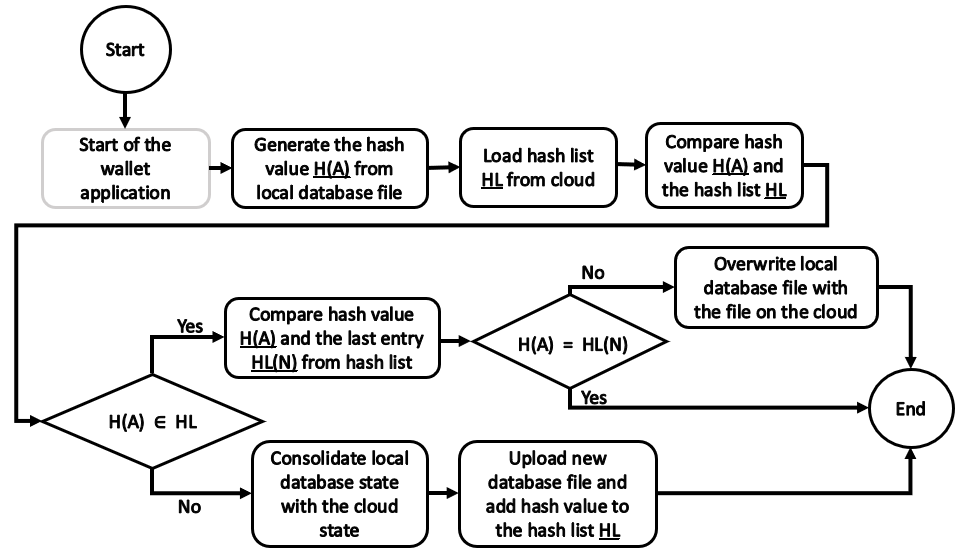
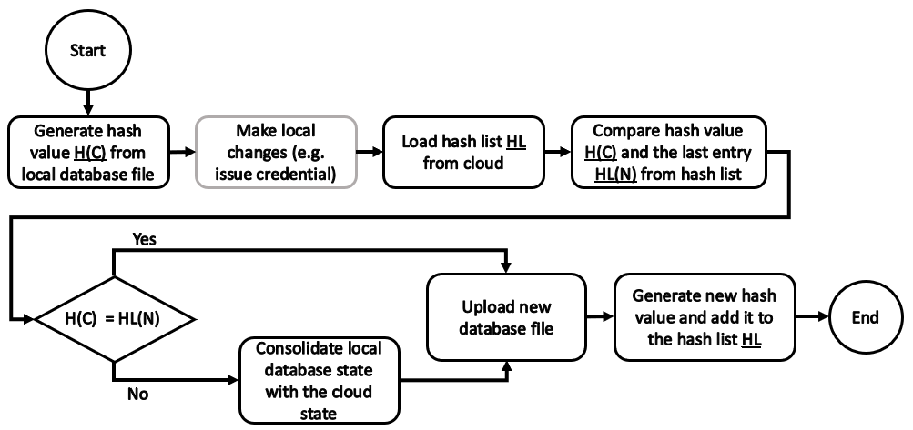

# Cloud synchronization for wallets

- Author: Jonas Schneider, esatus AG - j.schneider@esatus.com
- Date: 2021-02-24
- Status: in process, not published

This document discribes a concept for synchronization of wallet applications in Hyperledger Aries via cloud.

## Table of Contents <!-- omit in toc -->

- [Motivation](#motivation)
- [Problem and requirements](#problem-and-requirements)
- [Concept](#concept)
  - [Initialization](#initialization)
  - [Synchronization](#synchronization)
- [Conclusion](#conclusion)

## Motivation

There is no standardized solution for automatically synchronizing credentials and connections stored in a wallet with other wallet applications. This document introduces a concept to solve this problem. It addresses the question of how to synchronize wallets between applications, especially from different vendors, to improve interoperability. The aim of this document is to provide a concept that can be implemented by all vendors and further developed by the Hyperledger community.

## Problem and requirements

Because of the linked secret it is not possible to synchronize credentials or connections between different wallets. This concept offers a solution in which the whole wallet is synchronized. The concept was developed with the idea that all wallet application vendors can easily integrate without any restrictions. The more vendors participate in the concept, the better the interoperability of the wallet applications.

The concept provides a solution for synchronization via cloud services. The user should be able to choose which cloud is used. Therefore, as many cloud solutions as possible should be supported.

## Concept

The following sections describe the concept. Three files are stored on the cloud, which are needed for synchronization. The first file is the SQLite database file, which contains the wallet data. In addition, the agent options are serialized in JSON notation and stored encrypted on the cloud. The last file contains a hash list which is used to prevent inconsistencies. This is described in more detail in the sections [Initialization](#initialization) and [Synchronization](#synchronization).\
The data model is also illustrated in the following figure.

### Initialization

This section describes how the cloud synchronization will be initialized. In the scenario the *Wallet A* contains the data which should be synchronized to *Wallet B*. After the initialization, the data will be synchronized in both directions (see [Synchronization](#synchronization)).

**Wallet application A** is initializing the synchronization on the cloud. For this purpose, the application first saves the database file on the cloud. In addition, the agent options containing the wallet key are encrypted and stored on the cloud in JSON notation. Finally, a hash is created and added as the first entry to the hash list, which is also stored in a text file on the cloud.

**Wallet application B** is now able to receive the data. For this, the database file and the agent options must be downloaded and saved. After that both wallet applications are on the same state and contain the wallet key, so the credentials can be used in both applications.

### Synchronization

The synchronization of the data must be integrated at various points. The first synchronization is performing when the application is started. This is for checking if any changes have been made by other applications. In addition to that, synchronization should always be performed when a change has been made in the wallet. This section describes the synchronizations.

#### Synchronization at application start

The synchronization at application start has several purposes. The main purpose is to check if changes have been made by other applications. If this is the case, the synchronization should be performed at start, so the application is up to date. Another reason for the synchronization is to check if the application has made changes that have not yet been synchronized. This may occur if, for example, there is no connection to the cloud while issuing a credential.

The process of synchronization starts with the generation of the hash value of the local SQLite databases file. In the next step the value is compared with the hash list of the cloud. If the value is equal to the last value in the list, the states are identical and there is no need to perform synchronization. If the value is not equal to the last one but exists in the list, the local database must be overwritten with the state on the cloud. In this case, changes were made by another application.\
If the value does not exist in the list, there are unsynchronized changes on the local database. These changes must be consolidated with the database file on the cloud. After the consolidation, the new database file must be uploaded on the cloud and a new hash value of this state must be added to the hash list.\
The process is also illustrated in the figure below.

#### Synchronization at changes

If a wallet application makes changes, they must be synchronized. Before these changes are made, a hash value off the local database file must be generated. After the changes (e.g., issuing credentials) have been executed, they must be synchronized with the cloud. For this purpose, the last value from the hash list is compared with the hash value that was generated before the changes were made. If both hash values are identical, the database which is containing the changes can be updated to the cloud and a new hash value added to the list. If the hash values are different, the changes must be consolidated with the data off the database file on the cloud, before updating the cloud. The states should be consolidated after changes are made so it reduce the interruption of the user interaction.\
The process is also illustrated in the figure below.

## Conclusion

The presented concept offers cross-application synchronization of wallets. The concept can be implemented and used by all vendors. As a cloud solution, all providers can be used. It is not necessary to run a service on the cloud, as the functions only run on the applications. It is also possible to use an FTP server or a NAS instead of a cloud. In the future, the concept shall be developed and improved by all wallet application vendors. A best practice implementation which can be used by all developers so it is easy to integrate the synchronization.
